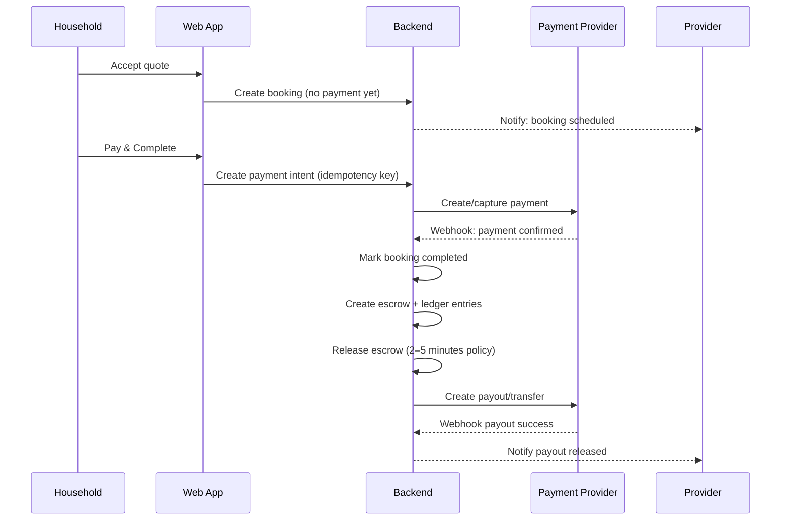

# Nirmio — System Architecture (Web-first, India, Escrow Payments)

Date: 2026-01-08

## 0) Scope & Non-goals

**In scope (v1)**
- Web-only (responsive) marketplace for:
  - Homeowners/households posting projects/jobs
  - Workers/professionals offering services (e.g., painter, POP designer)
  - Material suppliers listing/selling products
- In-app payments with an **escrow-style** flow (customer pays → platform holds/controls release → provider/supplier receives payout)
- India-first: UPI/cards/netbanking; GST invoices as applicable; basic verification and audit trail
- Supplier **registration fee of ₹1600** (one-time)

**Non-goals (v1)**
- Native mobile apps
- Full ERP inventory sync for suppliers
- Real-time bidding or complex auctions

## 1) Product Roles & Core Capabilities

**Roles**
- Household (customer)
- Worker/Professional (service provider)
- Supplier (materials seller)
- Admin/Support (operations)

**Core capabilities**
- Identity, profiles, and verification (phone OTP)
- Listings:
  - Services (providers)
  - Products (suppliers)
- Search + discovery (by category + location)
- Projects/Jobs, quotes, booking/scheduling
- Orders for materials (checkout)
- Escrow payments, payouts, refunds, disputes
- Messaging between parties
- Reviews/ratings after completion
- Supplier registration fee (₹1600)

## 2) Architecture Approach (MVP → Scale)

### 2.1 Recommended v1 shape: Modular Monolith + Managed Services
Start with **one backend** repo/app (modular monolith) for speed, with strict domain boundaries, backed by managed Postgres + object storage.

When scaling, extract high-load modules (Messaging, Search, Notifications, Payments) into services.

### 2.2 Key non-functional requirements
- Security: strong auth, RBAC, secure webhooks, idempotency
- Integrity: ledger-backed payments (source-of-truth internal records)
- Reliability: queues for async, retries, dead-letter handling
- Observability: logs/metrics/traces, audit logs
- Compliance (India): use licensed payment aggregator/marketplace product; store minimal PII; retention policies

## 3) Logical Components

### 3.1 Client apps
- Web App (React + Vite or similar):
  - Household portal
  - Provider portal
  - Supplier portal
  - Admin portal (can be separate app or role-based pages)

### 3.2 Edge
- CDN (static assets)
- WAF + rate limiting
- API Gateway / Load Balancer

### 3.3 Backend modules (within modular monolith)
- Auth & Identity
- RBAC & Policy
- User Profiles (household/provider/supplier)
- Catalog
  - Services
  - Products
- Search indexing adapter
- Projects/Jobs
- Quotes & Booking
- Orders (materials)
- Payments
  - Escrow state machine
  - Ledger
  - Webhook handler
  - Payout orchestration
- Messaging
- Reviews
- Notifications
- Admin/Moderation
- Reporting/Analytics (basic)

### 3.4 Data stores
- PostgreSQL (primary OLTP)
- Redis (cache + rate limits + job queues if needed)
- Object Storage (images/docs)
- Search Index (OpenSearch/Elasticsearch) — optional for MVP (Postgres FTS + trigram can start)

### 3.5 External integrations (India)
- Payments: Razorpay / Cashfree / PayU (choose one)
  - UPI, Cards, Netbanking
  - Marketplace/route/split payouts if supported
- SMS/WhatsApp: Gupshup / Twilio (India routing) / other
- Email: SES/SendGrid
- Maps: Google Maps/Mapbox (geocoding, distance)

> Note: Exact escrow/marketplace flows depend on your payment provider’s product and current regulatory requirements. Treat the “escrow” mechanism as **provider-mediated holds + controlled release**, not a DIY banking system.

## 4) Data Model (Canonical)

Core tables/entities (simplified):
- `users` (id, phone, email?, status)
- `roles` + `user_roles`
- `profiles` (user_id, type, display_name, address, geo)
- `provider_services` (provider_id, category_id, price_model, service_area)
- `products` (supplier_id, name, category_id, specs)
- `product_offers` (product_id, supplier_id, price, stock, delivery_options)
- `projects` (household_id, category, description, location)
- `quotes` (project_id, provider_id, amount, scope, status)
- `bookings` (quote_id, schedule, status)
- `orders` (buyer_id, totals, status)
- `order_items`
- `payments` (type, provider, provider_ref, amount, currency, status)
- `escrows` (payment_id, purpose, state, hold_until, release_policy)
- `ledger_entries` (payment_id, account, debit, credit, reason)
- `payouts` (provider/supplier, amount, status)
- `refunds`
- `disputes`
- `conversations`, `messages`
- `reviews`
- `audit_logs`
- `supplier_onboarding` (supplier_id, fee_status, fee_payment_id, verified_at)

## 5) Payment & Escrow Design

### 5.1 Money-moving principles
- Never infer payment success from client-side callbacks alone—only from provider-confirmed webhooks.
- All payment-creating APIs must support **idempotency keys**.
- Maintain an internal ledger so you can reconcile with provider reports.

### 5.2 Payment types
1) **Supplier registration fee: ₹1600**
- Purpose: unlock supplier capabilities (listing products, receiving orders)
- Mode: one-time fee (recommended for v1) with future option for subscription
- Workflow:
  - Supplier initiates onboarding → create `payment_intent` for ₹1600
  - On webhook `payment.captured` → mark onboarding as active

2) **Service job escrow (household → provider)**
- v1 policy: **job completion is only possible after payment succeeds** (a single "Pay & Complete" flow)
- Workflow:
  - Booking can be created/scheduled without payment
  - When the customer attempts to complete, create a payment intent and collect payment
  - Only after payment webhook confirms success:
    - mark the booking as `completed`
    - release funds near-instantly (2–5 minutes)

3) **Materials order escrow (buyer → supplier)**
- Capture at checkout
- Release per platform policy (v1: near-instant release after payment success; see Release Windows)

### 5.3 Escrow state machine (internal)
States (example):
- `created` → `authorized_or_captured` → `in_escrow` → (`released` | `refunded` | `disputed`)

Release triggers:
- Service: v1 defaults to **near-instant release** after payment confirmation (minutes), and completion is only finalized after payment success
- Materials: v1 defaults to **near-instant release** after payment confirmation (minutes)

### 5.4 Release windows (v1 defaults)

Because you want release "instantly within few minutes", v1 uses these defaults:
- **Release delay**: 2–5 minutes after payment webhook confirms success
- **Dispute window**: disputes are handled **after release** via refund/chargeback workflows

Why a short 2–5 minute delay exists:
- Allows payment webhooks to arrive and be verified before money-moving actions (payout/transfer)
- Lets the system de-duplicate retries/idempotency and avoid double-payouts

If you later want a stronger escrow experience, switch per-category to a post-completion or post-delivery release window.

Disputes:
- With near-instant release, disputes typically happen **after payout**.
- Resolution options become: refund to customer (platform-funded or clawback if supported), partial refunds, goodwill credits, and/or provider penalties.
- If your payment provider supports it, implement **delayed payout** (even if payment is captured) to preserve true escrow behavior.

## 6) Security, Privacy, and Abuse Controls

**Security**
- RBAC + resource ownership checks for every endpoint
- Secure session management (httpOnly cookies or token rotation)
- Webhook signature verification, replay protection, strict allowlists
- Passwordless phone OTP rate limits and device checks

**Privacy**
- Minimize stored KYC/PII; store documents in object storage with signed URLs
- Data retention policy for logs and messages

**Abuse**
- Listing moderation workflows
- Fraud checks on high-value orders and repeated disputes
- Spam detection for messaging

## 7) Deployment (India-first)

### 7.1 MVP deployment
- Region: India (e.g., AWS Mumbai / Azure Central India)
- Frontend: Vercel/Netlify or same cloud CDN
- Backend: containerized app on Cloud Run / ECS / Azure Container Apps
- Postgres: managed DB with PITR
- Redis: managed
- Object storage: S3-compatible

### 7.2 CI/CD
- Build + unit tests
- Security scanning (deps)
- DB migrations on deploy
- Separate environments: dev/staging/prod

## 8) Observability & Operations
- Structured logs with correlation IDs
- Metrics: request rate, error rate, payment webhook failures, payout delays
- Tracing (OpenTelemetry)
- Alerts on:
  - payment webhook backlog
  - stuck escrows
  - increased dispute rate

## 9) Mermaid Diagrams

### 9.1 System context
```mermaid
flowchart LR
  U[Users (Household/Provider/Supplier)] --> W[Web App]
  W --> EDGE[CDN/WAF/API Gateway]
  EDGE --> API[Backend (Modular Monolith)]

  API --> PG[(PostgreSQL)]
  API --> R[(Redis)]
  API --> S3[(Object Storage)]
  API --> SRCH[(Search Index)]

  API --> PAY[Payments Provider]
  API --> SMS[SMS/WhatsApp]
  API --> EMAIL[Email]
  API --> MAPS[Maps/Geocoding]
```

### 9.2 Escrow release (service booking)


## 10) MVP Build Plan (What to build first)

1) Identity + roles + profiles
2) Supplier onboarding + ₹1600 fee + basic supplier dashboard
3) Listings (services + products) + basic search
4) Projects/jobs + quotes + booking
5) Orders (materials) + payment capture + escrow tracking
6) Messaging + notifications
7) Reviews + admin moderation

---

## Open Questions (to finalize v1)
- Escrow release rules: confirm the v1 default is near-instant (2–5 minutes) for both services and materials
- Supplier fee: one-time ₹1600; confirm GST invoice requirements
- Delivery model for materials: pickup vs last-mile delivery partners
- Verification: which documents required for suppliers/providers
